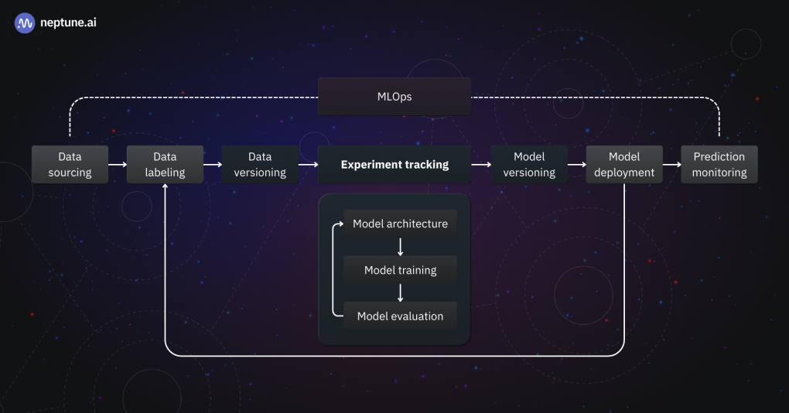

# Chapter 2 : Experiment Tracking with Mlflow 

## Important concepts

 - Ml experiment : The process of building an ML model
 - Experiment run: Each trial in an ML experiment
 - Run artifact: Any file that is associated with an ML run
 - Experiment metadata

## What's experiment tracking ?

Experiment tracking is the process of keeping track of all the **relevant information** from an **ML experiment**, which includes: 

- Source code
- Environment
- Data
- Model
- Hyperparameters
- Metrics
- ...

## Why is experiment tracking so important?

In general, because of these 03 main reasons: 

- Reproducibility
- Organization
- Optimization

## Mlflow

**Definition: "An open source platform for the machine learning lifecycle"**

In practice, it's just a python package that can be installed with pip, and it contains four main modules: 

- Tracking
- Models
- Model Registry
- Projects

## Tracking experiments with Mlflow

The Mlflow tracking module allows you to organize your experiments into runs, and to keep track of: 

- Parameters
- Metrics
- Metadata
- Artifacts
- Models

Along with this information, Mlflow automatically logs extra information about the run: 

- Source code
- Version of the code (git commit)
- Start and end time
- Author

## Installing Mlflow 

`pip` : pip install mlflow  
`conda` : conda install -c conda-forge mlflow

## Basic Mlflow Commands 

`import mlflow` --- To import mlflow  
`mlflow.set_tracking_uri("sqlite:///mlflow.db")` ---- Use sqlite as the backend store for tracking experiments  
`mlflow.set_experiment("nyc-taxi-experiment")` ----- Creating a new environment if one doesn't already exist  

`mlflow.log_artifact(local_path = "The local of the element you want to save, artifact_path = "Where you want to save the model in Mlflow")`  
`mlflow.xgboost.log_model(the model, artifact_path = "Where the model will be save in Mlflow")`

## Model Management

### Machine Learning LifeCycle

The machine learning lifecycle refers to the multiple steps that are needed in order to build and maintain a Machine Learning Model/System.

You should not use a folder system to manage your models. Why? : 

 - **Error prone:** It is possible that accidentally you end up overwriting an old model

 - **There is no versioning:**  Sometimes the name of the folder can indicate the version of the model, but this system become inefficient when you have a lot of versions

 - **No model lineage:** It is not easy to understand how all these models were created

 ## Model Registry 

 In ML, a model registry is a centralized repository or model store, similar to a library, that lets you effectively manage and organize machine learning models. Here are some clarifications about the model registry : 

 - The model registry is actually not deploying any model, the model registry only list the models that are production ready. And the stages are just labels that are assigned to the model.  

 - So you need to complement the model registry with some CI/CD code to do the actual deployment of this models.   

 ## Mlflow Tracking server

 MLflow Tracking Server is a stand-alone HTTP server that provides REST APIs for accessing backend and/or artifact store. Tracking server also offers flexibility to configure what data to server, govern access control, versioning, and etc. 

 

Common setups include : 

**Localhost** : By default, MLflow records metadata and artifacts for each run to a local directory, mlruns. This is the simplest way to get started with MLflow Tracking, without setting up any external server, database, and storage.

**Local Tracking with a local Database**: The MLflow client can interface with a SQLAlchemy-compatible database (e.g., SQLite, PostgreSQL, MySQL) for the backend. Saving metadata to a database allows you cleaner management of your experiment data while skipping the effort of setting up a server.

**Remote Tracking with Mlflow tracking server** : MLflow Tracking Server can be configured with an artifacts HTTP proxy, passing artifact requests through the tracking server to store and retrieve artifacts without having to interact with underlying object store services. This is particularly useful for team development scenarios where you want to store artifacts and experiment metadata in a shared location with proper access control.

