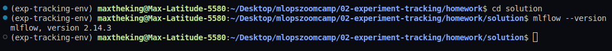
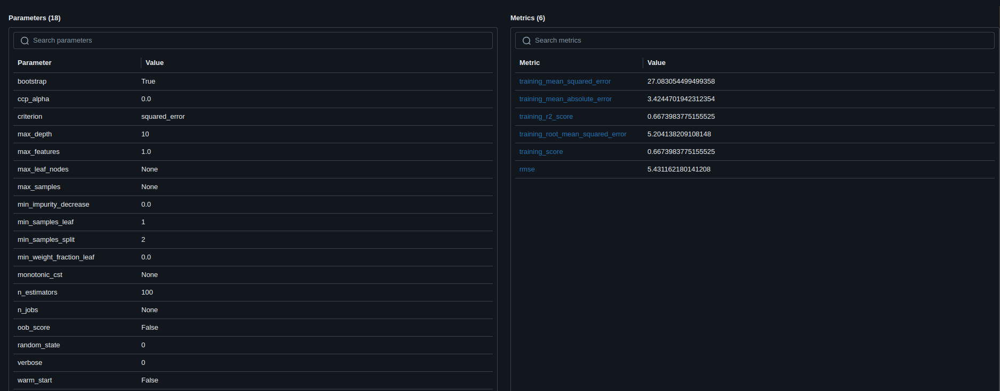
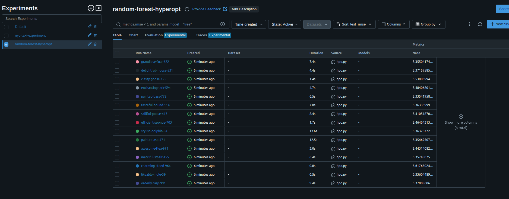

# Question 1 : Install Mlflow

What version do you have: **2.14.3** 

# Question 2: Download and preprocess the data

How many files were saved to the output folder :  **4**

# Question 3: Train a model with autolog

What is the value of min_sample_split parameter : **2**

# Question 4 : Launch the tracking server locally 

In addition to `backend-store-uri`, what else do you need to pass to properly configure the server ? : **default-artifact-root**

# Question 5 : Tune model hyperparameters

What is the best validation RMSE that you got? : **5.355**

